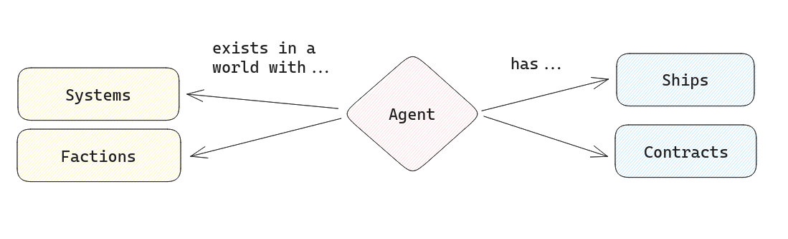
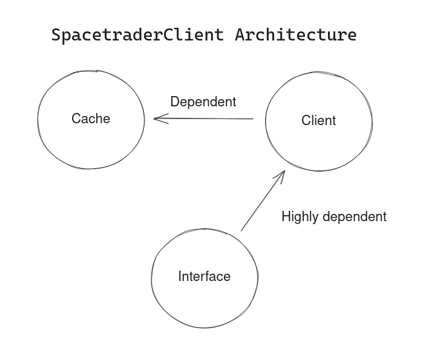
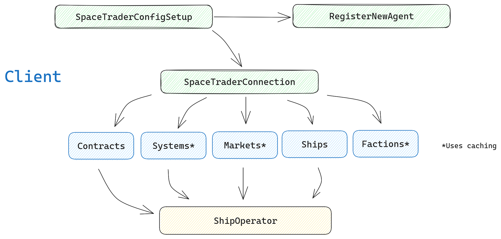
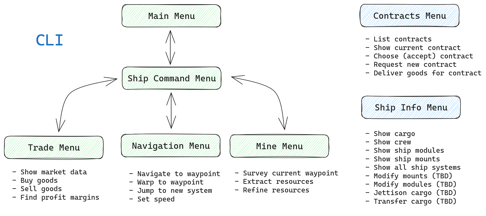

# About SpacetraderClient

## Brief overview of the SpaceTrader game and its architecture
The [SpaceTrader game](https://spacetraders.io/) is a multiplayer online game that sets a player ("agent") in a world with certain characteristics.
The agent starts the game with a **ship** to navigate the world with and a **contract** as a sort of 'quest'. Both of these attributes are player-specific.
By contrast, the world that agents play in has general attributes which are stable across players: the 'factions' that inhabit the world are stable and the systems (i.e., star systems, including details about planets, inhabitants, resources, etc.).



The purpose of the game is to explore and accrue wealth. To do that, players must travel throughout the world in their ship(s) and find resources and markets at which they can gather and trade items. By carefully gathering and trading items (and maximizing profits), players can advance more quickly, upgrade their ships, and become more capable in exploring the game world and accruing more wealth (space capitalism).

---

## Architecture of spacetraderClient
The architecture of spacetraderClient is divided into 3 sections:
- Client
- Cache
- Interface

The client hosts the main functioning of the application. The client assumes a certain structure to the cached files, and can create a cache if none exists. The client knows nothing about the interface.
The interface does assume certain functioning (i.e., certain classes, certain methods) of the client.

The Cache can be reorganized with minimal changes to the client. The interface requires substantial reworking if the client changes.

The client can work with different cache files (or no cache files), and the client knows nothing about the interface. The client, however, does assume a certain setup of cached files, if they exist. Read below to learn more about these separate sections and what they do.



---

### Client
The client hosts the core functionality of the application. The other components are only for extending the functionality of this component (e.g., the cache allows persistent data storage).

The purpose of the client is to make interaction with the Spacetrader API easier and more standardized. Additionally, it caches some data persistently in order to reduce the need for repeated calls. As such, the client closely follows the architecture of the [Spacetrader API](https://spacetraders.stoplight.io/docs/spacetraders/11f2735b75b02-space-traders-api).

---



---

The code for the client is organised into classes as a way to package functions and data conveniently. The primary base class is `SpaceTraderConnection`, which provides the foundation for calls to the SpaceTrader API.
The `SpaceTraderConfigSetup` provides some common utilities for interacting with the configuration `.yaml` file for the game (specifies players, etc.), and the `RegisterNewAgent` class allows the creation of new players and API keys (kept separate from SpaceTraderConnection class - which requires a player be alread set up).

The middle layer of classes - which I also call "Endpoint Classes" include `Agent`, `Contracts`,`Systems`,`Markets`,`Factions`, and `Ships`. These classes build upon the `SpaceTraderConnection` class and interact with endpoints related to "ships", "contracts", etc. From looking at the SpaceTrader API documentation above you will see the 1:1 relationship.

> Note: One large exception to this 1:1 relationship between classes and endpoint type is the `Markets` class. This class was created independently of the `Systems` class because:
> 1. Market information is quite important to the game and needs some additional specific processing
> 2. Market information is gathered independently of system information (market information can only be gathered in full if the player has a ship at the market location)

---

#### Structure of endpoint classes
The endpoint classes generally follow a similar architecture:

1. **Abstraction of all API endpoints:**
The primary purpose of each endpoint class is to provide methods with which to call specific API endpoints. These methods do some basic error-checking and formatting of data sent by the API. Some methods return data, others simply alter the game state and do not return anything. Other methods trigger a reload of cache data or another endpoint. The exact functioning depends on how the function operates on the game state.
    ```python
        #EXAMPLE OF AN ENDPOINT ABSTRACTION:
        #----------
        def get_jump_gate(self,waypoint:str) -> dict:
            """Returns information about what systems may be jumped to from a given jumpgate waypoint"""
            system = self.stc.get_system_from_waypoint(waypoint)
            url = f"{self.base_url}/{system}/waypoints/{waypoint}/jump-gate"
            response = self.stc.stc_http_request(method="GET",url=url)
            if not self.stc.response_ok(response): return
            return response
    ```

2. **Caching of (some) game data**
A secondary purpose of the endpoint classes is to allow custom caching of data - depending on the type of data the endpoints are working with. For example, systems data is very complex and large (>7k systems recorded as complex data structures). The caching strategy for systems is therefore different for factions data which is currently less than 20 records long and is fairly static. Similarly, some data like systems data is relevant for *all players of the game*. It can therefore be stored generically without needing to reference which player it is relevant for. Some data (such as for ships) is purposefully not cached since this data is specific to ships belonging to a specific player (i.e., very niche) and since ships data is quite volatile and changes constantly during gameplay.
    ```python
        #----------
        def cache_market(func: Callable) -> Callable:
            """
            Wrapper for an external, generic caching system.
            Passes a file path created from system variables and the 'waypoint' argument of the
            target function as values to the caching system to use in caching the data.
            Target function and its needed arguments (self,waypoint) also passed on.
            """
            def wrapper(self,waypoint:str):
                system = self.stc.get_system_from_waypoint(waypoint)
                path = self.__create_cache_path(system)
                return dict_cache_wrapper(file_path=path,key=waypoint)(func)(self,waypoint)
            return wrapper
    ```

---

Finally, we have the `ShipOperator` class.

`ShipOperator` is an important class which combines much (but not all) of the functionality of the endpoint classes to create a single interface for controlling a player's ship. As opposed to endpoint classes, `ShipOperator` uses its class attributes as a way to store game state information during runtime and keeps track of things like the cooldown in-between ship actions. **It introduces state to the client.** It's possible to use `ShipOperator` as a rudimentary interface for playing the SpaceTrader game in combination with some endpoints are not included in this class, such as `get_system` from the systems class and `get_faction` from the factions class. Note that these two endpoints (including others) are purposefully not included in the `ShipOperator` class because they represent more stable information which is not specific to any particular ship (or any particular player).
The `ShipOperator` can also serve as a convenient plug-in point for more sophisticated interfaces, since this single object conveniently stores relevant game state data and provides access to the most commonly-used endpoints.

---

### Cache

The cache is a persistent data store for holding game data across multiple game sessions - and potentially across multiple players as well. The basic functions for interacting with the cache to be in a local directory, although this directory can be changed or the code adapted to use remote storage (although this would likely negate the speed advantages of a cache).

The cache was set up to reduce the amount of API traffic (i.e., cached data is used if possible) and to allow the creation of information that is not immediately accessible via the existing API endpoints (this mostly pertains to market data - which can only be collected in full if a player's ship is at a market location).

---

The cache (stored in `./gameData` by default) is organized very similarly to the endpoint classes described in the 'client' section above: data of a particular type is stored together.

The caching functions in the endpoint classes are set up to cache data using the agent's callsign as a unique identifier if the data (e.g., contracts) is specific to an agent. Otherwise, identifiers are typically taken as the "ID" or "symbol" from the content of the cached data.

---

### Interface

The primary interface in development for playing the game is the **command line interface**, found within the `cli` directory.
This interface works off of a series of 'menus' that introduce various player options. Players can progress or return through these menus to access the functionality they need to play the game.

---



---

The menus in the CLI are hierarchical - players must progress through higher-level menus to reach lower-level ones.
Most of the game functionality is located in the lower-level menus (see bullet points for a mostly-complete list of functionalities), although the 'contract' menu is available from all menus and the 'ship' menu is available at all menus starting with the 'Ship Command' menu.

Most of the menus provide some additional user interface to help the player - for example, the command to navigate to a new waypoint provides the player with a list of waypoints in the current system, alongside a list of the traits of each waypoint.